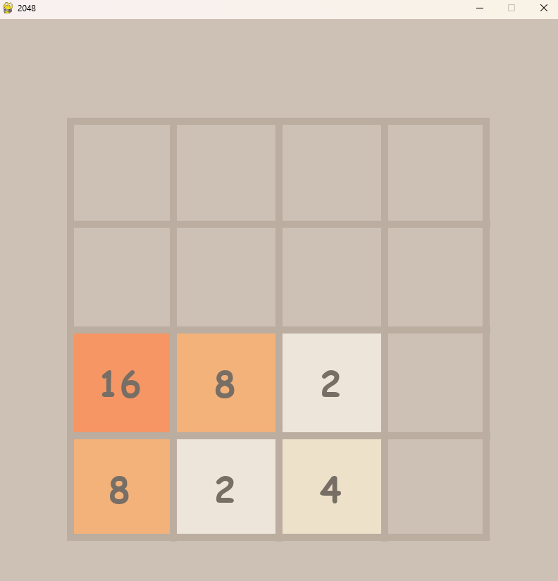

# 2048 Game – Python & Pygame

A smooth and functional recreation of the classic **2048 puzzle game**, built using **Python** and **Pygame**. This was my **first Python project**, inspired by [Clear Code's 2048 tutorial on YouTube](https://www.youtube.com/watch?v=6ZyylFcjfIg). I followed the guide closely but also made several changes and customizations to learn and practice Python and Pygame fundamentals.

---

## 🎮 Game Features

- 🧩 4x4 Grid just like the original 2048  
- 💠 Smooth tile movement and merging animations  
- 🎨 Visually styled tiles with unique colors for each value  
- ⌨️ Arrow-key controls for moving tiles (Up, Down, Left, Right)  

---

## 📸 Screenshots




---

## 🚀 Getting Started

### Prerequisites

- Python 3.7 or higher  
- Pygame library  

### Installation

1. **Clone this repository**
   ```bash
   git clone https://github.com/yourusername/2048-pygame.git
   cd 2048-pygame
